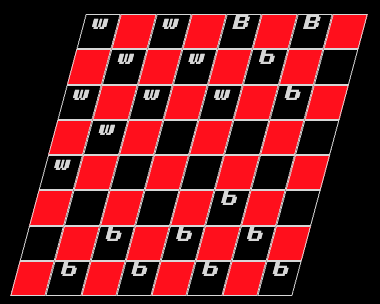
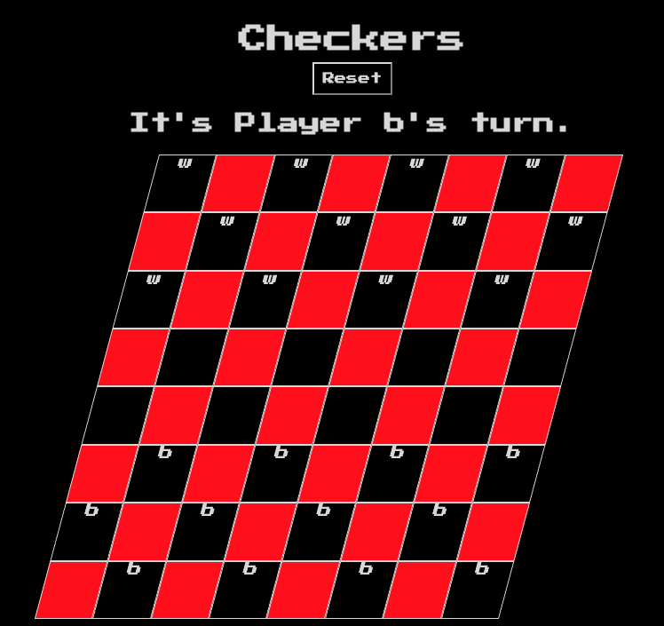

# Welcome to Checkers!
## Screenshots
1. 
2. 

## The Game
Checkers is a classic American(ish) board game. While there are significant variants across the globe, it's one of the first strategy games often taught to children. After building out 3d tic tac toe, I wanted to stretch the game logic I had to take on the movement of existing pieces versus the relatively simpler placing of new.

In its current iteration this game is true to real life- it doesn't prevent you from cheating! Players will take turns moving their pieces, including jumps, and getting their pieces "kinged." Multiple jumps are not currently supported.

## Getting Started
If you want to dive right in you can [play here.](https://zbrustkern.github.io/checkers/)
This game wasn't planned out to carefully beyond the work done for [Qubic](https://www.zbrustkern.github.io/qubic/)

## Attributions
1. [Google Fonts](https://fonts.google.com/) for the in game typography.
2. [Google Gemini](https://gemini.google.com/) helped with the concept art.

## Technologies Used
This game is pretty simple- the entire thing is written in HTML, CSS, and Javascript!

## Next Steps
There are many!
1. Multiple jumps is the biggest missing feature to play the full game properly.
2. Enforcement of legal moves is a possibility.
3. Refactoring the entire codebase to use a much more rational game logic that wasn't an evolution of tic tac toe would be a major improvement.
4. Better styling.
